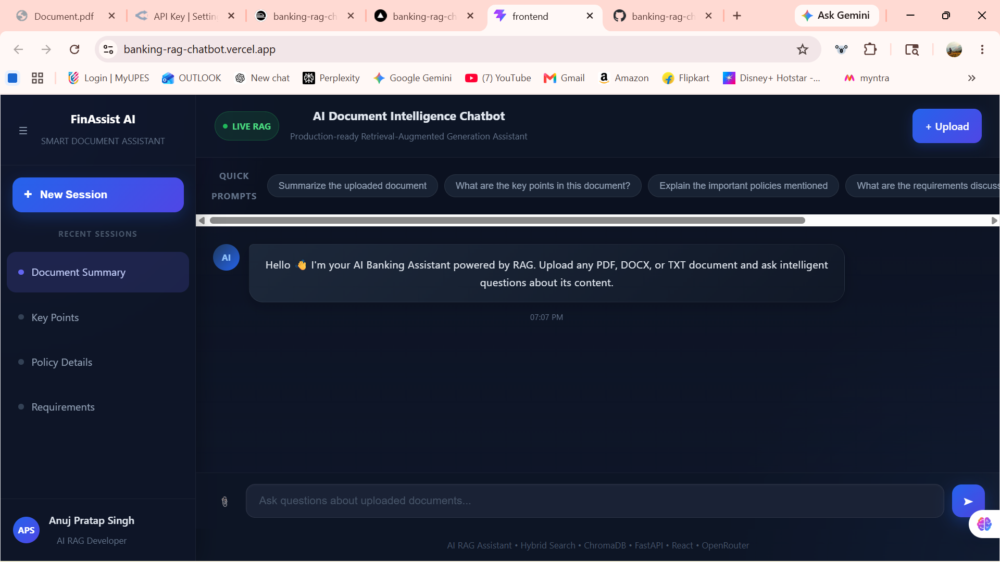
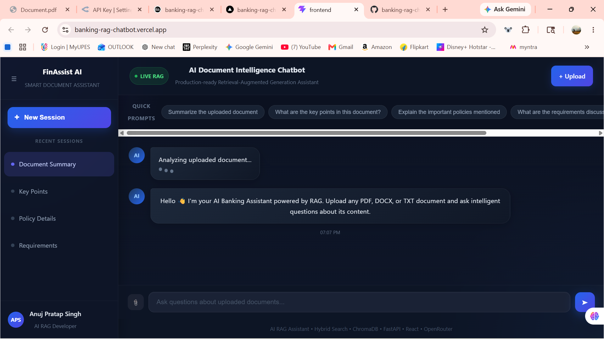
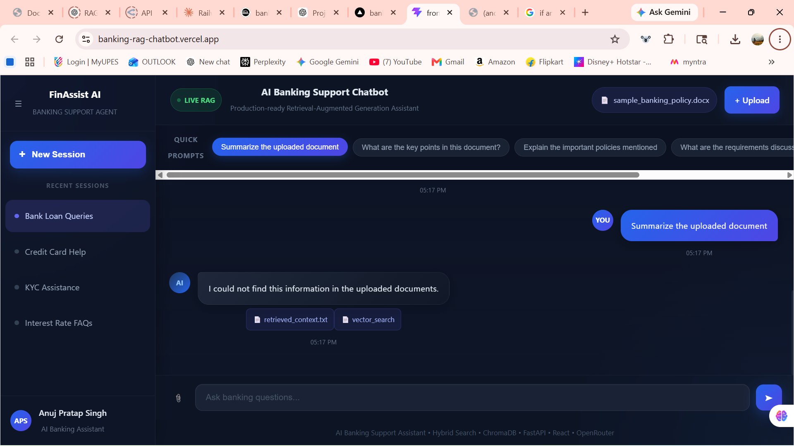
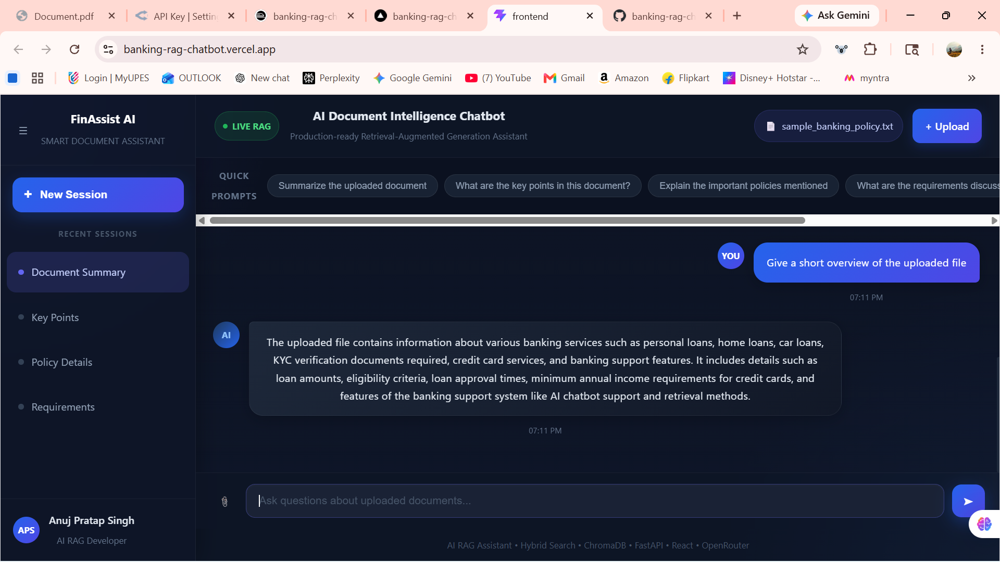
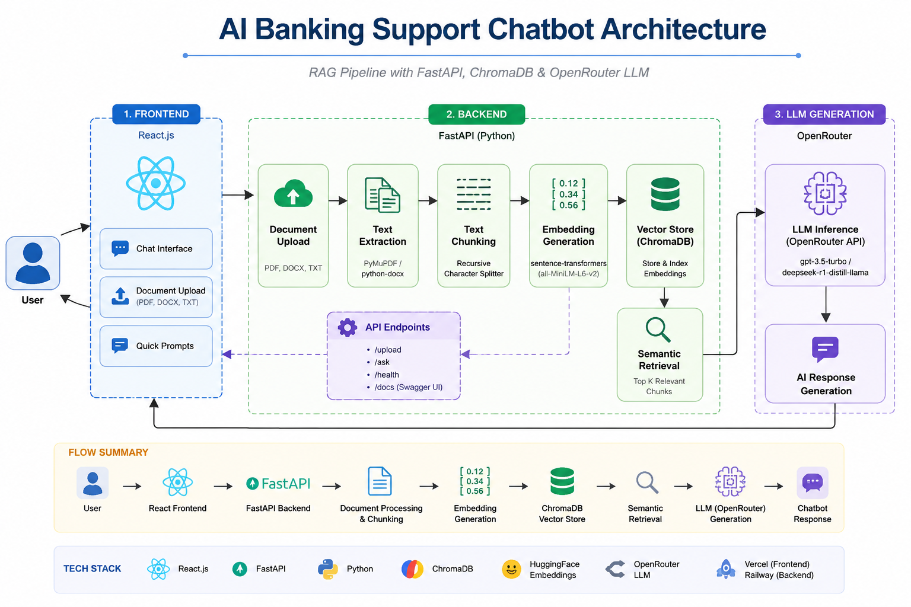

# AI Banking Support Chatbot using RAG

## Project Overview

This project is an AI-powered Banking Support Chatbot built using Retrieval-Augmented Generation (RAG).

The chatbot helps users interact with banking-related documents using natural language queries. Users can upload PDF, DOCX, and TXT files, and the chatbot retrieves relevant information from documents using semantic search and vector databases.

The project demonstrates:
- Generative AI integration
- RAG pipeline implementation
- Vector database retrieval
- FastAPI backend APIs
- React frontend integration
- Cloud deployment using free-tier services

---

# Features

## Conversational Chatbot
- Interactive AI chatbot interface
- Chat history support
- Session-style conversation flow
- Typing/loading animation

## Document Upload Support
- PDF support
- DOCX support
- TXT support

## RAG Pipeline
- Document ingestion
- Text extraction
- Text chunking
- Embedding generation
- ChromaDB vector storage
- Semantic retrieval
- Context-aware AI response generation

## Vector Database
- ChromaDB used for vector storage
- Similarity-based retrieval
- Semantic search support

## AI Features
- Retrieval-Augmented Generation (RAG)
- Grounded factual responses
- Prompt optimization
- Conversation memory improvements
- Hybrid retrieval support

## Deployment
- Frontend deployed on Vercel
- Backend deployed on Railway

---

---

---

# Project Screenshots

## Chatbot Interface



---

## Document Upload & AI Response



---

## Multi-Document Support - DOCX



---

## Multi-Document Support - PDF


---

## Multi-Document Support - TXT



---

# Architecture Diagram


# Tech Stack

## Frontend
- React.js
- Axios
- CSS

## Backend
- FastAPI
- Python

## AI / RAG
- ChromaDB
- sentence-transformers
- OpenRouter API
- BM25 Retrieval

---

# Project Architecture

Frontend (React)  
↓  
FastAPI Backend  
↓  
RAG Pipeline  
↓  
ChromaDB Vector Database  
↓  
OpenRouter LLM  

---

# API Endpoints

## POST /upload
Upload PDF, DOCX, or TXT documents.

## POST /chat
Send user queries and receive AI-generated responses.

## GET /health
Check backend health status.

---

# Setup Instructions

## Clone Repository

```bash
git clone https://github.com/anujpratap12/banking-rag-chatbot.git
```

## Backend Setup

```bash
cd backend

python -m venv venv

venv\Scripts\activate

pip install -r requirements.txt
```

Run backend:

```bash
uvicorn backend.main:app --reload
```

---

# Frontend Setup

```bash
cd frontend

npm install

npm run dev
```

---

# Environment Variables

Create a `.env` file inside backend:

```env
OPENROUTER_API_KEY=your_api_key
```

---

# Deployment Links

## Frontend
https://banking-rag-chatbot.vercel.app

## Backend
https://banking-rag-chatbot-production.up.railway.app

---

# Demo Flow

1. Upload a banking-related document
2. Ask questions about uploaded content
3. The chatbot retrieves relevant chunks
4. AI generates grounded responses using RAG

---

# Challenges Faced

- Cloud deployment issues
- Retrieval optimization
- Chunking quality improvements
- Semantic retrieval tuning
- Free-tier resource limitations

---

# Future Improvements

- Streaming responses
- Authentication
- Redis caching
- Advanced reranking
- Larger embedding models
- Multilingual support

---

# Bonus Features Implemented

- Prompt optimization
- Conversation memory improvements
- Hybrid retrieval support
- DOCX document support
- Upload processing animation
- Modern chatbot UI/UX

---

# Assignment Requirements Covered

- Conversational chatbot interface
- Complete RAG pipeline
- Vector database integration
- Semantic retrieval
- Cloud deployment
- API/backend development
- PDF/TXT/DOCX support
- Context-aware response generation

---

# Constraints Followed

- Used free-tier resources only
- No hardcoded credentials
- Graceful error handling
- Grounded and factual responses

---

# Author

Anuj Pratap Singh

AI & ML Engineering Student  
UPES Dehradun